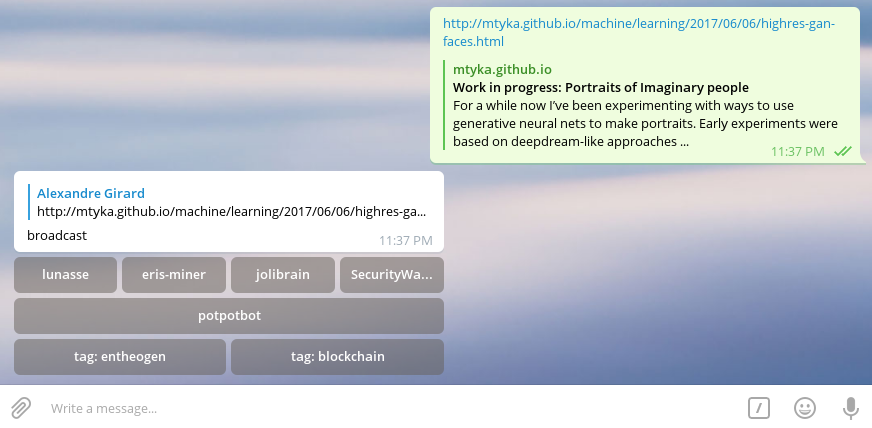

# BotCast - Telegram Broadcasting Bot

* [Setup](#setup)
* [Configuration](#configuration)
* [Running](#running)

 

**BotCast** is a Telegram bot that can be use to broadcast an input in various channels.

It helps if you spend a lot of time copy/pasting the same information in various groups/channels.

You can use this bot by sending it, for example, an interesting link. It'll answer your with an inline keyboard with the possible destination where you'd want to broadcast this interesting link.

It reduces multiple copy/paste in a simple inline keyboard.

It'll also save a csv file containing the history of the interaction with this bot.


## Setup

```
yarn install
cp config.js.sample config.js
```

## Configuration

### Tokens

You must create a `.env` file and setup your tokens.

For example:

```
TELEGRAM_TOKEN=233429842:dwdwedkjewfowfeoeifjwfjwfe
SLACK_TOKEN=kdiru-23832749873492834-34889327498320234987283749893d329828
```

* To create a Telegram Token, [create a new bot](https://core.telegram.org/bots#6-botfather) with @BotFather
* To create a Slack Token, connect to your [Legacy Token](https://api.slack.com/custom-integrations/legacy-tokens) page

### config.js

`config.js` file must be filled with your informations.

* *config.owner* : your telegram login, you'll be the only one able to speak to your bot
* *config.backup_file* : path to your csv backup file

### config.connectors

You can setup broadcast connectors in `config.js`.

* *text* : text that will be displayed on the inline keyboard
* *callback_data* : unique id for this connector, it will be saved in the backup file
* *broadcast_method* : method used to broadcast this message, only `telegram` available at the moment
* *chat_id* : if `broadcast_method = telegram`, this variable is used to select the channel where the message will be sent
* *row* : row position on the inline keyboard

### Telegram chat_id

If you need to configure a Telegram `broadcast_method`, you will need the `chat_id` corresponding to the channel where you want to broadcast your information.

To get this id, invite your bot in the selected channel, then send this comment in the channel: `/get_id`

The bot will answer with the channel `chat_id` and you can fill this information in your `config.js` file.

# Running

## Create your bot on Telegram

1. Add `@BotFather` in your Telegram contact list
2. Create a new bot with command: `/newbot`
3. Give it a *name* and an *username*
4. `@BotFather` will give you a token to access the HTTP API

## Fill config

1. Create a `.env` file at the root of your **BotCast** code
2. Fill it with the previous token like this:

```
TELEGRAM_TOKEN=@BotFather_given_token
```

3. Edit `config.js` *owner* with your Telegram username

## Start the bot

You can now start the bot with this command in **BotCast** root path: `yarn start`

## Add Telegram broadcast channel

1. Invite the bot to a channel you'd like to broadcast to
2. When the bot is added to this channel, type this command inside the channel: `/get_id`
3. The bot will answer you with an integer, it's the *chat_id* of this channel
4. Fill the `config.js` connectors section with a new connector:

```
{
  text: 'my favorite channel',
  callback_data: 'broadcast_to_favorite_channel',
  broadcast_method: 'telegram',
  chat_id: replace_with_correct_chat_id,
  row: 0
}
```

5. You must restart the bot process

## Add Slack broadcast channel

1. Create an incoming webhook for the channel you want to broadcast to: [incoming webhook integration](https://my.slack.com/services/new/incoming-webhook/)
2. Fill the `config.js` connectors section with a new connector:

```
{
  text: 'my favorite channel',
  callback_data: 'broadcast_to_favorite_channel',
  broadcast_method: 'slack',
  web_hook: ' https://hooks.slack.com/services/YOUR_CUSTOM_WEBHOOK_URL',
  channel: '#channel_where_to_broadcast_to',
  bot_name: 'bot username',
  row: 0
}
```

3. You must restart the bot process
